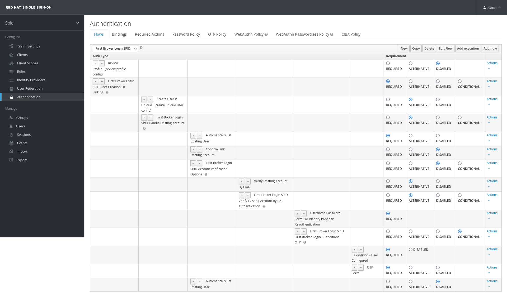
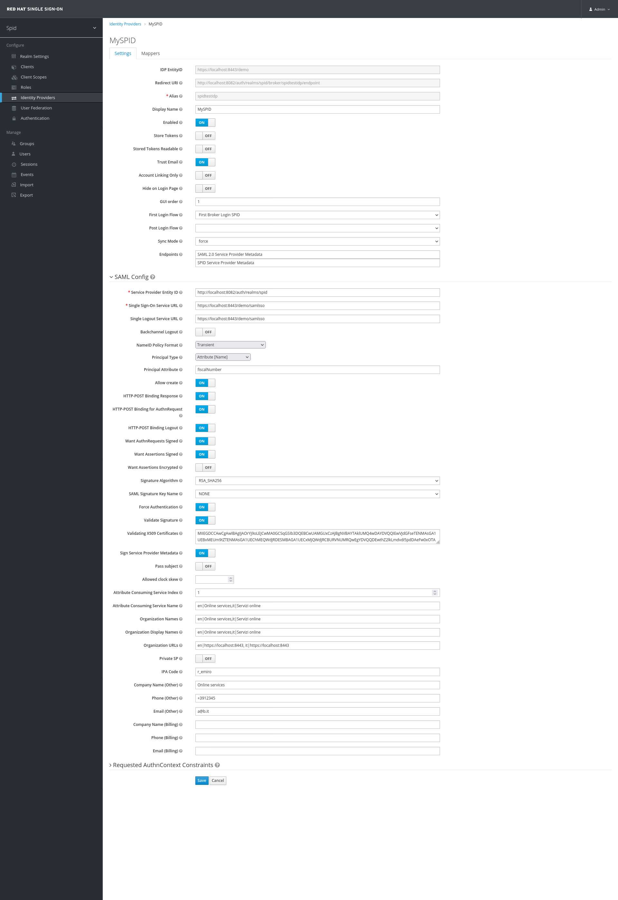
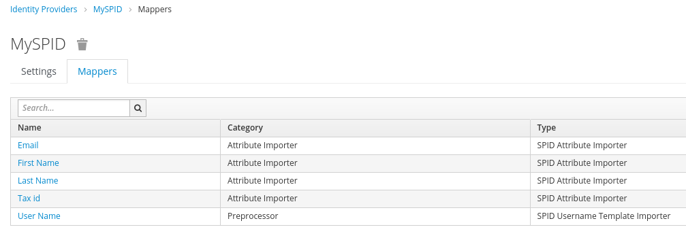

# keycloak-spid-provider

Italian SPID authentication provider for Keycloak v.15.0.1+ (https://www.keycloak.org/)

This guide describe the steps required to successfully integrate a Keycloak environment with the SPID federation.

## Prerequisites

- Keycloak full-working installation (version *15.0.1+*): the following instructions expect an environment variable named **$KC_HOME** to be set to the root directory of the Keycloak instance
- a recent Docker installation
- JDK 8+
- Git
- Maven

## Install keycloak-spid-provider

### Build the jar file

Clone this git repository and build it using Maven:

```shell
$ git clone https://github.com/redhat-italy/keycloak-spid-provider.git
$ cd keycloak-spid-provider
$ mvn clean package
```

After a successful build you will find the `spid-provider.jar` jar file in the `target` directory.

### Deploy into Keycloak

The instructions consider a *standalone* installation but are applicable to *managed domain* installations as well (changing the target directory names where it is required).

Shutdown the Keycloak server.

Copy the jar file into Keycloak `deployments` directory.

```shell
$ cp target/spid-provider.jar $KC_HOME/standalone/deployments/
```

> **Note**
>
> For developing purposes the wildfly maven plugin has been included. Please, remember to update the wildfly port config section in the file pom.xml while developing to use the plugin.
> 
> Each time you copy the jar file in the `deployments` directory, Keycloak automatically deploys it at the bootstrap. Nevertheless it may happen that the previous version of the same deployment doesn't get overridden.
> 
> It is recommended to cleanup any existing installed deployment in $KC_HOME/standalone/data/content/ related to the same jar module, before restarting Keycloak.

Copy the custom theme (`keycloak-spid-only`) into Keycloak `themes` directory in order to enable the standard SPID login button in the login page.

```shell
$ cp -r theme/keycloak-spid-only $KC_HOME/themes
```

Since you probably installed Keycloak on your local host, define a custom hostname (e.g. `spidsp`) for it to refer to that Keycloak instance (the service provider) instead of using `localhost`.

```shell
$ echo '127.0.0.1 spidsp' >> /etc/hosts
```

Use this hostname (e.g. `spidsp`) to connect to the Keycloak console, also while generating the xml metadata file/url.

Start the Keycloak server:

```shell
$ $KC_HOME/bin/standalone.sh -b 0.0.0.0 -Djboss.socket.binding.port-offset=2
```

The bind address is set to *0.0.0.0* to listen on any interface, in order to relax any network configuration issue.

Furthermore the `port-offset` value has been set in order to remap ports and avoid any collision with the ports opened by the SPID testing tool (see next sections).

During Keycloak bootstrap you should see log entries like the following:

```
10:13:25,178 INFO  [org.jboss.as.server.deployment] (MSC service thread 1-4) WFLYSRV0027: Starting deployment of "spid-provider.jar" (runtime-name: "spid-provider.jar")

...
10:13:32,178 INFO  [org.keycloak.subsystem.server.extension.KeycloakProviderDeploymentProcessor] (MSC service thread 1-4) Deploying Keycloak provider: spid-provider.jar
...

10:13:34,044 INFO  [org.jboss.as.server] (ServerService Thread Pool -- 33) WFLYSRV0010: Deployed "spid-provider.jar" (runtime-name : "spid-provider.jar")
```

The SPID custom provider has been correctly deployed and to verify that the module is correctly available and active, you can open the Keycloak admin console and access the **Identity Providers** section, choose the **Add provider** dropdown and you should find the **SPID** entry.

## Repeated deployments and cache

In order to deploy a modified version of the jar file, you can just repeat the deployment commands described above. However sometimes Keycloak caches don't get flushed when a new deployment occurs: in that case a quick workaround is to edit `$KC_HOME/standalone/configuration/standalone.xml` file and temporarily disable the theme/templates caching replacing the following xml block:

```xml
<theme>
  <staticMaxAge>2592000</staticMaxAge>
  <cacheThemes>true</cacheThemes>
  <cacheTemplates>true</cacheTemplates>
  <dir>${jboss.home.dir}/themes</dir>
</theme>
```

with the following:

```xml
<theme>
  <staticMaxAge>-1</staticMaxAge>
  <cacheThemes>false</cacheThemes>
  <cacheTemplates>false</cacheTemplates>
  <dir>${jboss.home.dir}/themes</dir>
</theme>
```

Then restart Keycloak and it will reload the new resources from the jar package.
Make sure you also cleared your browser caches (or use *incognito mode*) when verifying the correct deployment. After the first reload you can turn back on the caches and restart Keycloak again (if required).

## Install and configure the local SPID SAML Check docker environment

The *SPID SAML Check docker environment* ([https://github.com/italia/spid-saml-check](https://github.com/italia/spid-saml-check)) is a Docker environment that "emulates" the online SPID Test IdP ([https://demo.spid.gov.it](https://demo.spid.gov.it)).

*SPID SAML Check* is an application suite that provider some tools for Service Providers, useful for inspecting requests shipped to an Identity Provider, checking metadata compliance and sending custom responses back to Service Provider.
It includes:

- [spid-sp-test](https://github.com/italia/spid-sp-test) to check the SPID specifications compliance (command line executable tests)
- a web application (*spid-validator*) that provides an easy to use interface for testing success and error scenarios
- a web application (*spid-demo*) that acts as a test IdP for demo purpose

Clone the SPID SAML Check project repository and build the Docker image:

```shell
$ git clone https://github.com/italia/spid-saml-check.git
$ cd spid-saml-check
$ docker build -t italia/spid-saml-check .
```

Visit https://github.com/italia/spid-saml-check or follow the README.md in the repo for extra instructions to set up a container with the test environment.

Run the container:

```shell
$ docker run --name spid-saml-check-idp-demo -t -i -p 8080:8080 italia/spid-saml-check
```

The web server of the SPID SAML Check docker environment is now available at [https://localhost:8080](https://localhost:8080).

Execute the following command in order to get the IP address of the host as seen inside the container, in order to map it with the custom hostname `spidsp`, previously declared for the host machine running Keycloak.

```shell
docker exec -it spid-saml-check-idp-demo /bin/sh -c "ping host.docker.internal | head -n 1 | cut -f 2 -d '(' | cut -f 1 -d ')' | tr -d $'\n'"
```

It should print the IP address (for recent Docker versions on Windows/Mac it is usually 192.168.65.2).

If you are using podman replace `host.docker.internal` with `host.containers.internal` in the command above. 
In this case the IP address usually is 192.168.1.192. 

Then execute the following command to set the `spidsp` hostname alias (inside the container) to the IP address, replacing the string `<IP-ADDRESS>` with the IP address printed by the previous command (e.g. 192.168.65.2).

```shell
docker exec -it spid-saml-check-idp-demo /bin/sh -c "echo '<IP-ADDRESS> spidsp' >> /etc/hosts"
```

This way you can use URLs with `spidsp` as hostname inside the SPID SAML Check web interface (e.g. `http://spidsp:8082/auth/realms/spidrealm/spid-sp-metadata`), avoiding hostname mismatching errors.

Instead you can access the SPID SAML Check using localhost (on port 8080).

The test identity provider (SPID SAML Check) exposes two metadata: 

- one can be used to test the login/logout functionality and exposes the descriptor at [https://localhost:8080/demo/metadata.xml](https://localhost:8080/demo/metadata.xml). 
- another one can be used to validate the service provider (Keycloak) metadata, requests and responses in order to pass all of the checks required by AGID. It exposes the descriptor at [https://localhost:8080/metadata.xml](https://localhost:8080/metadata.xml)

You will need these endpoints later to setup the Keycloak Identity Provider configurations.

To stop the SPID SAML Check running container just kill the `docker run...` command with *CTRL+C*.

## Setup Identity Provider(s)

Come back to Keycloak admin console.

Select the target realm (or create one if required).

Select the *Realm Settings* item from the left menu, click on *Themes* tab and set `keycloak-spid-only` theme as *Login Theme*.

The following instructions can be reused to define all of the Identity Providers supported by SPID.

### Setup a custom "First Broker Login" Authentication Flow

This step is required because we want that if a user logs in with different identity providers (even different SPID authorized IDPs), they are all linked to the same Keycloak user account (if already existent, otherwise it gets created).

However, even if the username is the same, Keycloak will trigger by default an "Existing Account Verification" step with link confirmation: since this is not desirable because we trust the information from SPID IdPs, we define a new *First Broker Login* Authentication Flow to automatically set the existing user.

1. In the Keycloak admin console, select the *Authentication* item from the left menu;
2. In the *Flows* tab, select *First Broker Login* and then click *Copy*;
3. Set the name of the new flow to *First Broker Login SPID*;
4. In the newly created *First Broker Login SPID* set the *Requirement* column radio button of the *Review Profile (review profile config)* execution to *DISABLED*. This makes sure that at the first successful login the user will not be prompted to confirm his email address;
5. Search for the *First Broker Login SPID Handle Existing Account* hierarchy entry and click on the *Actions* command on the right, then select *Add Execution*;
5. Choose the provider *Automatically Set Existing User* and click *Save*;
6. With the up/down arrows, move the new execution above the *Confirm Link Existing Account* entry;
7. Set the *Requirement* column radio button of the *Automatically Set Existing User* execution to *Required*
8. Set both the *Confirm Link Existing Account* and the *First Broker Login SPID Account Verification Options* radio buttons to *Disabled*.



### Identity Provider configuration

1. Select the *Identity Providers* item from the left menu, click on *Add provider*, then select *SPID*;
2. In the *Add Identity Provider* page, scroll to the bottom and set the *Import from URL* field to the provider metadata url endpoint (if the import from URL does not work, use wget to download the xml file and import it as file):
   - for *SPID SAML Check Demo IDP* [https://localhost:8080/demo/metadata.xml](https://localhost:8080/demo/metadata.xml)
   - for *SPID SAML Check Validator IDP* [https://localhost:8080/metadata.xml](https://localhost:8080/metadata.xml) 
3. Click on the Import button.

Most of the fields will be filled in automatically.

Fill in the other fields as follows (leave the other fields as set by default).

#### Main section
- **Alias**: enter a name for the provider (it will be used as an URL component, so DO NOT enter space characters). In order to use the standard SPID Login button for tests, this field must be set to `spidtestidp`, otherwise apply the right changes to the custom theme.
- **Display Name**: the name of the IDP (it will be the name of the login button on the Keycloak login page)
- **Trust Email**: set to `ON`
- **First Login Flow**: select `First Broker Login SPID` (defined in the previous section)
- **Sync Mode**: select `force`


#### SAML Config section
- **Service Provider Entity ID**: `http://<keycloak-base-url>/auth/realms/<your_realm_name>`
- **Single Sign-On Service URL**: 
- **NameID Policy Format**: set select box to `Transient`
- **Principal Type**: set to `Attribute [Name]`
- **Principal Attribute**: appears when *Principal Type* is set. Set it to `fiscalNumber`
- **Want AuthnRequests Signed**: set to `ON`
- **Want Assertions Signed**: set to `ON`
- **SAML Signature Key Name**: set to `NONE`
- **Force Authentication**: set to `ON`
- **Validate Signature**: set to `ON`
- **Sign Service Provider Metadata**: set to `ON`
- **Attribute Consuming Service Index**: set to `1`. This corresponds to the index of the Attribute Consuming Service defined in your SP metadata - if you have more than one, you can change it to the value you need.
The following attributes are used to automatically generate a SPID compliant SAML SP metadata document.  
As the SPID SP metadata is actually the "union" of all the metadata for the different IdPs, you will only need to set those in the first SPID IdP in alphabetical order. The values for all the other providers will be ignored, so just leave them blank.

- **Attribute Consuming Service Names**: comma separated list of localized service names. Each string should be entered in the format `<locale>|<text>` (e.g. `en|Online services,it|Servizi online`)
- **Organization Names, Organization Display Names, Organization URLs**: Localized data for the organization, same format as above (e.g. `en|Online services,it|Servizi online` for both *Names* and *Display Names*, for `en|http://localhost:8080, it|http://localhost:8080` *URLs*)
- **Private SP**: set to `ON` if your organization is a private entity, `OFF` if it is a Public Administration
- **IPA Code** (Public SP only): Enter the IPA Code of the Public Administration
- **VAT Number**, **Fiscal Code** (Private SP only): Enter the VAT Number and the Fiscal Code of the private entity
- **Company Name (Other), Phone (Other), Email (Other)**: Technical contact info for the organization (any value is ok for testing purposes)
- **Company Name (Billing), Phone (Billing), Email (Billing)** (Private SP only): Billing contact info for the organization (any value is ok for testing purposes). Leave the fields blank if the SP is a Public one.

#### Requested AuthnContext Constraints section

Here you can specify which SPID Level you want to request to the IdP:

- **Comparison**: set to `Minimum` or `Exact` depending on your needs (usually set as `Exact`)
- **AuthnContext ClassRefs**: enter - in order from the most preferred to the least preferred - one or more of the SPID Authentication Level classes. Valid values are:
  - `https://www.spid.gov.it/SpidL1`
  - `https://www.spid.gov.it/SpidL2` (usually set as unique value)
  - `https://www.spid.gov.it/SpidL3`

Save the configuration.



### Configure Identity Provider Mappers

Click on the *Mappers* tab in the newly created *Identity Provider* configuration

Set the *User Name attribute*, the *Basic attributes* and, if required, one or more attribute mappers among *Other attributes*.

#### User Name attribute
Click on the *Create* button and set the following attributes:

| Name | Mapper Type	| Template | Sync Mode | Target |
| ---- | ---- | ---- | ---- | ---- |
| User Name	| SPID Username Template Importer | ${ATTRIBUTE.fiscalNumber} | inherit | LOCAL | 

All SPID users will have their username set to their fiscalNumber (lowercased according to the Keycloak convention).

#### Basic attributes
First Name and Last Name are required to identify the user and should be always mapped to special Keycloak attributes. Define the following two required mappers:

| Name | Mapper Type | Attribute Name | User Attribute Name | Sync Mode |
| ---- | ---- | ---- | ---- | ---- |
| First Name  | SPID Attribute Importer | name         | firstName         | inherit |
| Last Name   | SPID Attribute Importer | familyName   | lastName          | inherit |
| Tax Id      | SPID Attribute Importer | fiscalNumber | spid-fiscalNumber | inherit |
| Email       | SPID Attribute Importer | email        | spid-email        | inherit |

> *NOTE**
> 
> Avoid mapping the email assertion to the basic email Keycloak attribute, in order to avoid dangerous security issue: users could trigger the *Forgot Password* flow, and set a local password for the SPID account. If this happens, you can't trust the user to have a valid SPID session.
> 
> It is much safer to map the email attribute to a SPID-specific attribute (e.g. spid-email) as described in the next paragraph.

#### Other attributes

All of the other SPID attributes are optional and follow the same convention. Refer to the following table as a guide:

| Name | Mapper Type | Attribute Name | User Attribute Name |
| ---- | ---- | ---- | ---- |
| SPID Code | SPID Attribute Importer | spidCode | spid-spidCode | 
| Email | SPID Attribute Importer | email | spid-email |
| Tax Id | SPID Attribute Importer | fiscalNumber | spid-fiscalNumber |
| Gender | SPID Attribute Importer | gender | spid-gender |
| Date of Birth | SPID Attribute Importer | dateOfBirth | spid-dateOfBirth |
| Place of Birth | SPID Attribute Importer | placeOfBirth | spid-placeOfBirth |
| County of Birth | SPID Attribute Importer | countyOfBirth | spid-countyOfBirth |
| Mobile Phone | SPID Attribute Importer | mobilePhone | spid-mobilePhone |
| Address | SPID Attribute Importer | address | spid-address |
| Digital Address | SPID Attribute Importer | digitalAddress | spid-digitalAddress |
| Company Name | SPID Attribute Importer | companyName | spid-companyName |
| Company Address | SPID Attribute Importer | registeredOffice | spid-registeredOffice |
| VAT Number | SPID Attribute Importer | ivaCode | spid-ivaCode |



## Generating and configuring Service Provider metadata

The SPID Service Provider metadata (xml) document can be automatically generated clicking on the *SPID Service Provider Metadata* link available in the *Identity Provider* configuration page (the same filled in the previous section) at the label *Endpoints*.

The link has the following standard format:

 `http(s)://<host>:<port>/auth/realms/<your_realm_name>/spid-sp-metadata` 

example: `http://spidsp:8082/auth/realms/spid/spid-sp-metadata`

> **NOTE**
> 
> All the "shared" data (*Organization* fields, *Company* fields, etc.) in the metadata is actually set by the first SPID IdP in alphabetical order only. Thus, there is no need to copy the same data in all of the IdPs.
> 
> The attribute mappings in the AttributeConsumingService section are automatically populated from the configured Mappers for the first SPID IdPs in alphabetical order.

Configure the Service Provider Metadata in the *SPID SAML Check* tool as described in the README of the tool repo:

Example:

1. Connect to the *SPID SAML Check* tool at [https://localhost:8080](https://localhost:8080), using `validator` as both username and password;
2. Set the SP metadata xml url (`http(s)://<host>:<port>/auth/realms/<your_realm_name>/spid-sp-metadata`) in the *Metadata URL* field and download it, clicking *Download*;

## Testing login - logout

Now you can try to login using a configured client. For example you could use the built-in *Account* client application.

1. Browse to the Keycloak Account app: `http://<host>:<port>/auth/realms/<your_realm_name>/account/`;
2. The login page will appear with the standard SPID login button;
3. Click that button and choose spid-saml-check entry;
4. You should be redirected to the *SPID SAML Check* IDP login page;
5. Enter any spid level 2 users found in https://localhost:8080/demo/users (as of the time of writing you can use ada/password123);
6. You should be redirected to the *Account* application page showing user data acquired from the IDP;
7. Try to click the logout button to test also this flow.

## Acknowledgements
The main java code and some html/js/css snippets are taken/forked from or inspired by the same custom provider, developed by *Luca Leonardo Scorcia*, available at [https://github.com/italia/spid-keycloak-provider](https://github.com/italia/spid-keycloak-provider).

This project is released under the Apache License 2.0, same as the main Keycloak package.
